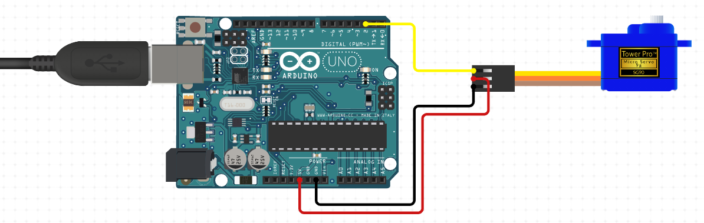

## Introduction

The Year 2020 is dominated by the global COVID-19 Pandemic. People wearing Face Masks, to protect themselves against an Infection, is an omnipresent Picture.

This Project uses a Combination of OpenCV Face Tracking and a TensorFlow Neural Network to detect Faces and distinguish between People wearing a Face Mask and People who don't.

Those Informations are used to control an automated Camera-Mount, to track People not wearing a Face Mask.

## Project Structure


#### 1. Face Tracking

- OpenCV is used to capture a live Video from a Webcam
- Using the *Deep Neural Network* capabilities of OpenCV with a pretrained Caffe Model to implement Face Tracking

#### 2. Face Mask Detection
- Training a custom Convolutional Neural Network with MobileNet as a base Model

- The tracked Faces from the Webcam Feed are used as an Input for the CNN

- Based on the prediction the Box Color and Label changes (green for *Mask* and red for *No Mask*)


#### 3. Automated Camera-Mount
- Using the XY-Coordinates of the Face Tracking, an Arduino controlled automated Camera-Mount follows detected Faces without a Face Mask

## General Usage

1. Clone the Git repository: `git clone https://github.com/samuelrothen/face_mask_detector.git`
2. Install the requirements: `pip install requirements.txt`
3. Run `/src/live_video_detection.py` to start the live Video Detection


## Arduino Usage
The usage of an Arduino is disabled by default. If you want to use an Arduino to control the Camera Positioning, follow these Steps:

1. Connect a Servo Motor to your Arduino using the following Wiring:



2. Upload the `.ino`-Sketch from `src/aduino_sketch/python_servo_sketch/python_servo_sketch.ino` using the [Arduino IDE](https://www.arduino.cc/en/software)

3. Open `/src/live_video_detection.py` and set `use_arduino` to `True` (default is `False`)  and define your Arduino COM-Port in `serial.Serial(...)`

```python
use_arduino = True
if use_arduino:
    arduino = serial.Serial('COM3', 9600)
```

4. Run the Python File

## License

Distributed under the MIT License. See `LICENSE` for more Information.


