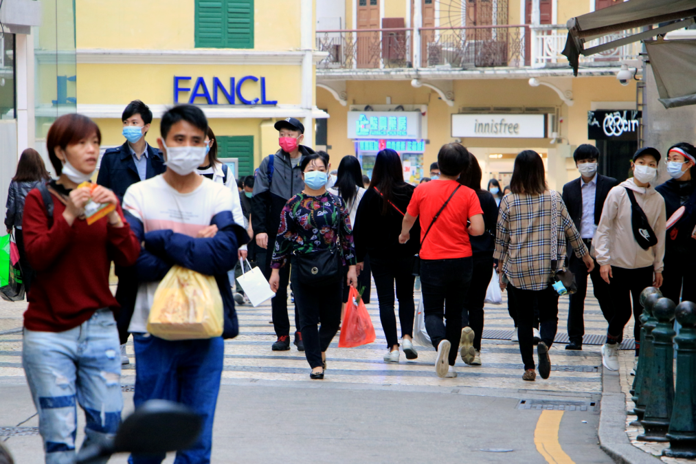
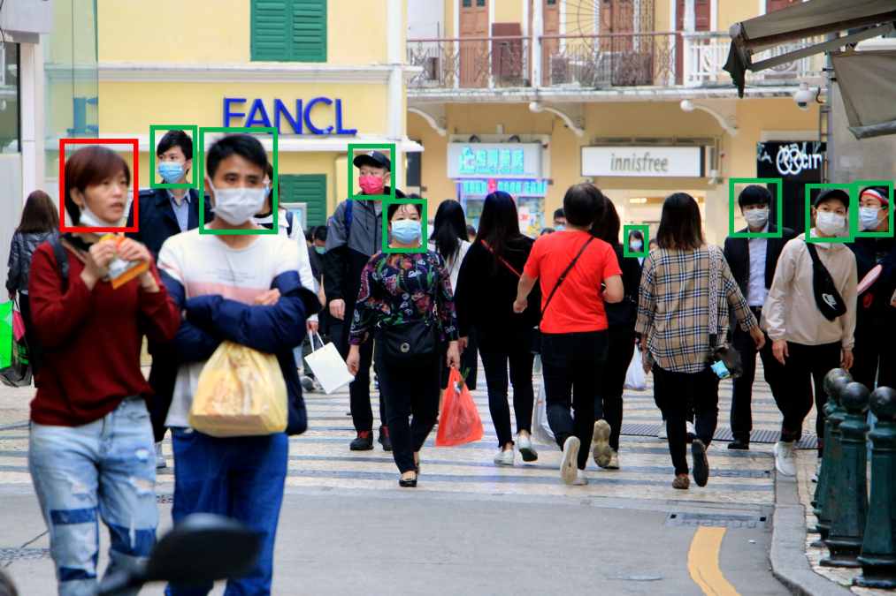
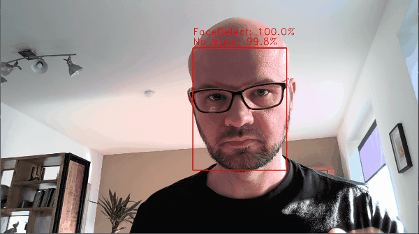
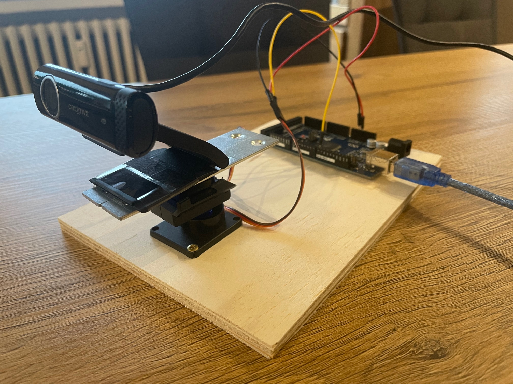
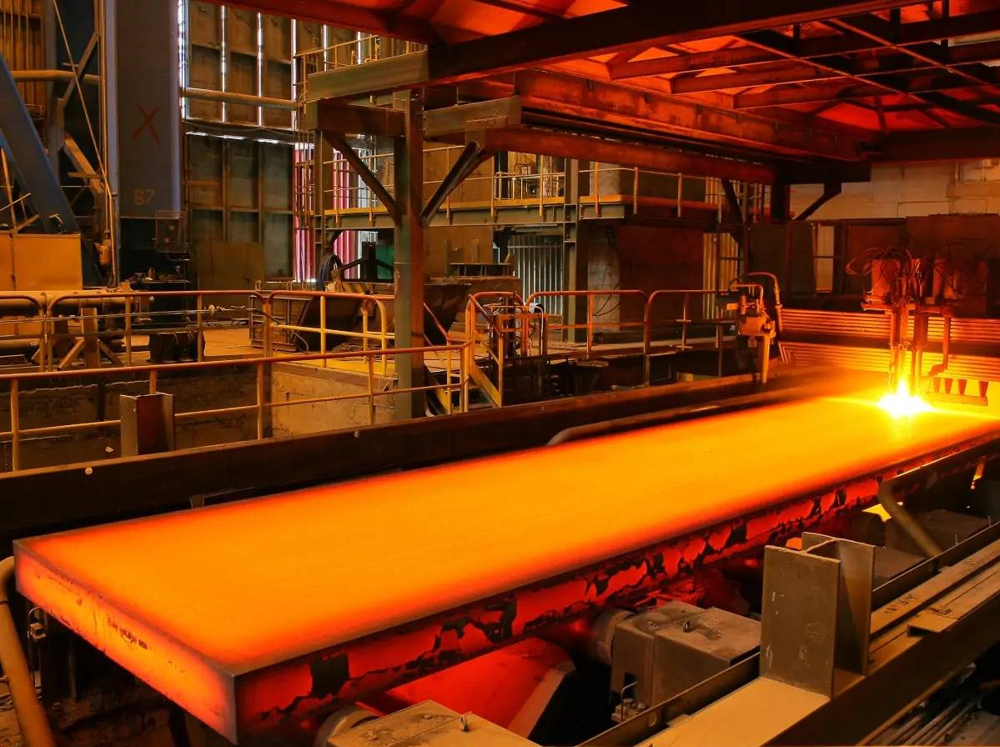

## Project Introduction <i class="far fa-compass"></i>

{ width=80% }

## Project Introduction <i class="far fa-compass"></i>

{ width=80% }

## Project Goals <i class="fas fa-clipboard-list"></i>

{ width=100% }

1. Live Face Tracking
2. Face Mask Detection
3. Automated Camera-Mount that tracks People without Face Mask

## Project Structure <i class="fas fa-project-diagram"></i>

{ width=100% }

## Project Structure <i class="fas fa-project-diagram"></i>

{ width=100% }

## Project Structure <i class="fas fa-project-diagram"></i>

{ width=100% }

## Project Structure <i class="fas fa-project-diagram"></i>

{ width=100% }

## Live Face Tracking <i class="fas fa-user"></i>

{ width=80% }

## Face Mask Detection <i class="fas fa-head-side-mask"></i>

{ width=80% }

## Automated Camera-Mount <i class="fas fa-video"></i>

{ width=60% }

## Complete System <i class="fas fa-cogs"></i>

{ width=80% }

## Project Outlook <i class="fas fa-binoculars"></i>

{ width=100% }

- Radar-Camera-Fusion
- Detect Oxidation on Steel Slab Surface
- Live Adjustment of the Radar-Configuration

## Random Statistics <i class="far fa-chart-bar"></i>

- <i class="fab fa-python"></i> **273** Lines of Python-Code 
- <i class="fas fa-microchip"></i> **39** Lines of Arduino-Code 
- <i class="fab fa-github"></i> **23** Commits to GitHub 
- <i class="fas fa-images"></i> **4.515** Train/Test-Pictures 
- <i class="fas fa-ellipsis-v"></i><i class="fas fa-ellipsis-v"></i><i class="fas fa-ellipsis-v"></i> **2.386.286** Neurons 
- <i class="fas fa-layer-group"></i> **6** Model-Layers 
- <i class="fas fa-redo"></i> **68** Epochs for Training 
- <i class="far fa-clock"></i> **50** Minutes to train the Model
