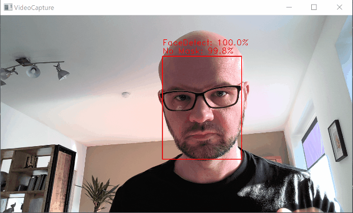

## Project Introduction <i class="far fa-compass"></i>

{ width=80% }

## Project Introduction <i class="far fa-compass"></i>

{ width=80% }

## Project Goals <i class="far fa-question-circle"></i>

- Face Tracking
- Face Mask Detection
- Camera follows People w/o Face Mask

## Project Structure <i class="fas fa-sort-alpha-down"></i>

** IMAGE OF PROJECT STRUCTURE **

## Demo Mask Detection <i class="fas fa-head-side-mask"></i>

{ width=80% }

## Demo Live Tracking <i class="fas fa-video"></i>

{ width=80% }

## Project Outlook <i class="fas fa-binoculars"></i>

{ width=100% }

- This text will appear to the right
- This text will appear to the right
- This text will appear to the right

## Random Statistics <i class="fas fa-chart-line"></i>

- <i class="fab fa-python"></i> **1.000** Lines of Python-Code 
- <i class="fas fa-microchip"></i> **54** Lines of Arduino-Code 
- <i class="fab fa-github"></i> **500** Commits to GitHub 
- <i class="fas fa-images"></i> **4.515** Train/Test-Pictures 
- <i class="fas fa-redo"></i> **68** Epochs for Training 
- <i class="far fa-clock"></i> **50** Minutes to Train the Model 
- <i class="fas fa-bullseye"></i> **99,3%** Validation Accuracy

